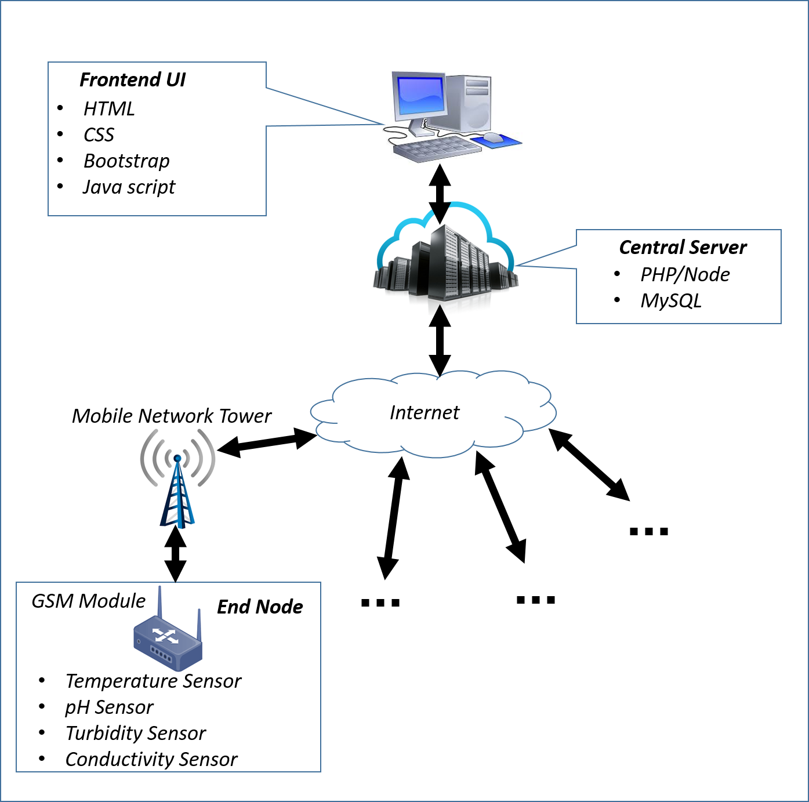

[comment]: # "This is the standard layout for the project, but you can clean this and use your own template"

# Real Time Water Qualtiy Measurement System

---

## Team
-  E/14/142, INDIKA J.A.A., [e14142@ce.pdn.ac.lk](mailto:e14142@ce.pdn.ac.lk)
-  E/14/364, WARUSAMANA D.N., [e14364@ce.pdn.ac.lk](mailto:e14364@ce.pdn.ac.lk)
-  E/14/380, WELIKALA E.Y., [e14380@ce.pdn.ac.lk](mailto:e14380@ce.pdn.ac.lk)

## Table of Contents
1. [Introduction](#introduction)
2. [Solution Architecture](#solution-architecture )
3. [Links](#links)

---

## Introduction

The traditional method adopted by environmental authorities in measuring the quality of water is to collect water samples from various locations and send them to the laboratories for for analysis, but this is inefficient and ineffective as it is time consuming, wasting human labour, and not economical. To get a analysis by observing previous records will also be difficult in this technique. If real time monitoring is required, this method is unable to provide expected outcomes as it may not be possible to take samples and send them immediately to the laboratories for analysis.

The system consists of several sensors located in remote locations to measure the water quality real time (most probably near water resources around industrial environments). The information received by sensors are sent to a centralized system which is monitoring the water quality measurement through GSM modules. These information can be sent at a predefined interval of time and they can be analyzed from the central monitoring system. Moreover, this system is only accessed by the authorized personnel only who works at environmental authorities. Hence, the system is secured with access restrictions.

 

Main objectives are as follows  

1. Cost effective

2. Time saving

3. Remote monitoring and centralized controlling

4. Higher scalability

5. Higher security

6. Easy Report generation for analysis

7. Power efficient/ Power saving

 

#### Overview

These are the main subject areas to be covered in each course as this is a joint project.

- CO321 - Power efficiency is planned to control mainly through the embedded system. Since, this system is operating real time power consumption has to be controlled efficiently. Micro-controller based system is utilized for this purpose. Design has to be focused on power efficiency.

 

- CO324 - Information sensed through sensors are sent to the centralized system containing a central server which handles all the data received from various sensors located at different locations. Since information are sent through various nodes simultaneously, there will be a heavy network traffic and it has to be handled efficiently by techniques to handle them.

 

- CO325 - The system is only accessible by the officers working in the environmental authorities and data transactions are secured so that they cannot be retrieved or intercepted by third parties. Information authentication and verification, secure data transactions are the main issues regarding security.

## Solution Architecture

Overview of Infrastructure:

The qualities that can be measured vs qualities we wish to measure are as follows:

According to the Central Environmental Authority (CEA) of Sri Lanka and Environmental Protection Agency(EPA) of United States of America these are the typical water quality parameters measured. 

   1. pH

   2. Conductivity

   3. Temperature

   4. Turbidity

   5. Dissolved Oxygen (DO)

   6. BOD - Biological Oxygen Demand

   7. COD - Chemical Oxygen Demand

   8. Dissolved Heavy Metals and their concentrations

   9. Fully or partially dissolved organic and inorganic compounds and their concentrations

From these only qualities from 1) to 4) can be measured in this project since rest of the qualities involve deep chemical analysis of samples.

### Embedded Systems Design

- pH value of water is measured using a pH probe and it is connected to an end node connected to the system.
- Temperature is measured using an LM35 temperature sensor
- Turbidity sensor has to be made manually. For that the amount of light traveled through the water is measured. Either an LED or a laser is used as a light source and it is measured  using a photo diode/LDR and the levels are calibrated accordingly into levels.
- Conductivity is measured using two electrodes connected at an end node of the system.  

Atmega MCU is used at each node and it is used to manipulate the power consumption by each sensor. Further, it used to control all the peripherals connected to the end node.

 

All the above components are connected to make a single end node of the system.

 

### Web and Network Application Design

A GSM module connected at each end is used to communicate between the node and the central server.  

GPRS is used to transfer data packets from the end node to the central server via the Internet.  

TCP/UDP are used as Transport Layer protocols and IP is used as Network Layer Protocol.  

#### Back end

The following technologies are used to develop the back end web application

   1. MySQL

   2. PHP or Node.js

#### Front end

   1. HTML

   2. CSS

   3. JavaScript

   4. Bootstrap

### Computer and Network Security

Sensitive data of this system include the following.

   1) Monitored data from each node - They have to be protected.For instance, an industry owner which may be releasing harmful substance to water resources may intercept the data transfer from a node situated in a water source near the industry and send fake data to cover up their actions

   2) User information stored in the central server

   3) Login requests to the central server

Most of the above sensitive data can be encrypted to ensure security.  

  
[Project overview video](https://youtu.be/UtAgY8P4kIw)  

### Documents  
  
- [A detailed description of infra structure](data/documents/1.pdf)  
- [User Manual](data/documents/3.pdf)
- [Project Design](data/documents/4.pdf)

## Links  

- <a href = "https://github.com/cepdnaclk/e14-3yp-Real-Time-Water-Qualtiy-Measurement-System" target = "_blank">Project Repository</a>
- <a href = "https://cepdnaclk.github.io/e14-3yp-Real-Time-Water-Qualtiy-Measurement-System/" target = "_blank">Project Page</a>
- <a href = "http://www.ce.pdn.ac.lk/" target = "_blank">Department of Computer Engineering</a>
- <a href = "https://eng.pdn.ac.lk/" target = "_blank">University of Peradeniya</a>

[//]: # (Please refer this to learn more about Markdown syntax)
[//]: # (https://github.com/adam-p/markdown-here/wiki/Markdown-Cheatsheet)
